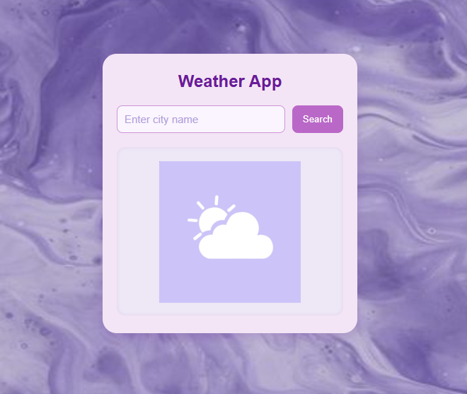

# 🌦 Weather App

A simple weather forecast web app built using **HTML**, **CSS**, and **JavaScript**.  
It fetches real-time weather data from the **OpenWeatherMap API** and displays temperature, humidity, and weather conditions for any city entered by the user.

---

## 🚀 Features

- 🌍 Search weather by city name  
- 🌡 Displays temperature, humidity, and description  
- ☁️ Dynamic weather icons  
- 💜 Clean pastel-purple UI  
- ⚙️ Uses OpenWeatherMap API  
- 🔒 API key stored separately in `config.js` (not uploaded to GitHub)

---

## 🛠️ Tech Stack

| Purpose | Tools Used |
|----------|-------------|
| Frontend | HTML, CSS, JavaScript |
| API | OpenWeatherMap |
| Version Control | Git & GitHub |

---

## 💡 Example Usage

1. Type a city name (e.g., “Chennai”).  
2. Click the **Search** button.  
3. The app shows:  
   - Current temperature  
   - Weather description  
   - Humidity  
   - Weather icon  

---

## 📸 Screenshot 

---

## 🧠 Learning Highlights

- Using **Fetch API** to get JSON data  
- Handling API responses & errors  
- Updating DOM elements dynamically  
- Separating API keys for safety  

---

## 📝 License

This project is open source and available under the **MIT License**.
